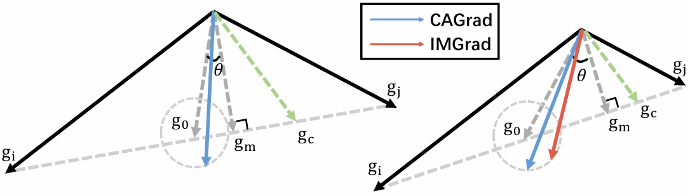

# Injecting Imbalance Sensitivity for Multi-Task Learning
This is the implementation of our IJCAI'25 paper "[Injecting Imbalance Sensitivity for Multi-Task Learning](https://arxiv.org/pdf/2503.08006)". In this paper, we highlight the importance of imbalance for MTL, and develop an imbalance-sensitive approach, i.e., IMGrad.
<p align="center">

</p>

## Image-to-Image Prediction
The supervised multitask learning experiments are conducted on NYU-v2 and CityScapes datasets. We follow the setup from [MTAN](https://github.com/lorenmt/mtan). The datasets could be downloaded from [NYU-v2](https://www.dropbox.com/sh/86nssgwm6hm3vkb/AACrnUQ4GxpdrBbLjb6n-mWNa?dl=0) and [CityScapes](https://www.dropbox.com/sh/gaw6vh6qusoyms6/AADwWi0Tp3E3M4B2xzeGlsEna?dl=0). After the datasets are downloaded, please follow the respective run.sh script in each folder. In particular, modify the dataroot variable to the downloaded dataset.

### Run Experiment
The dataset by default should be put under `experiments/EXP_NAME/dataset/` folder where `EXP_NAME` is chosen from `{celeba, cityscapes, nyuv2, quantum_chemistry}`. To run the experiment:
```
cd cityscapes/
sh run.sh
```

## Correspondence
If you have any further questions, please feel free to contact Zhipeng Zhou by zzp1994@mail.ustc.edu.cn

## Citations
If you find our work interesting or the repo useful, please consider citing this paper:
```
@article{zhou2025injecting,
  title={Injecting Imbalance Sensitivity for Multi-Task Learning},
  author={Zhou, Zhipeng and Liu, Liu and Zhao, Peilin and Gong, Wei},
  journal={arXiv preprint arXiv:2503.08006},
  year={2025}
}
```
